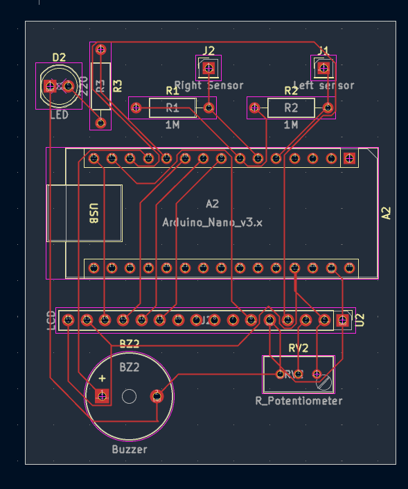
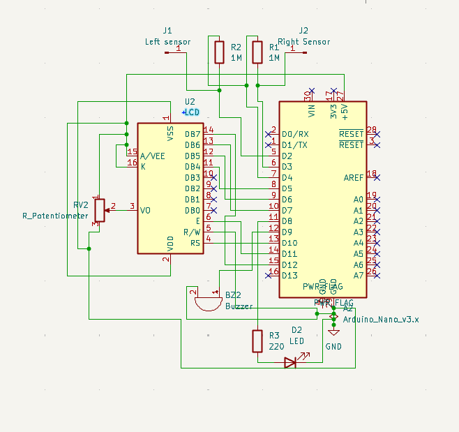
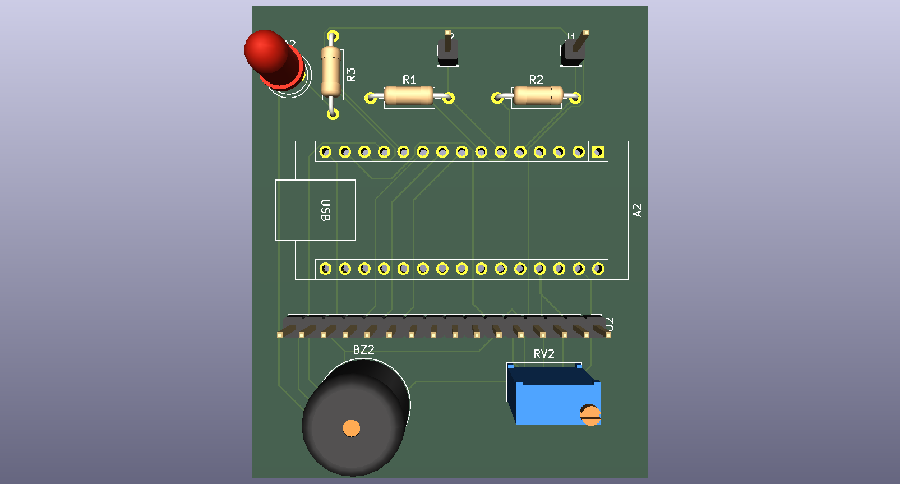
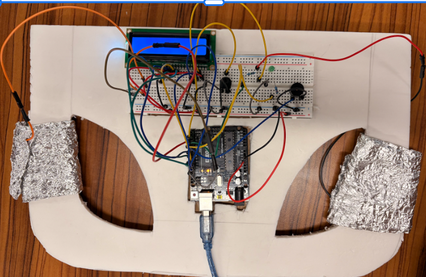

# Steering Wheel Hand-Detection PCB

This project is a capacitive hand-detection system that checks whether a driver's hands are on a steering wheel.

I first built and tested the idea using an Arduino, aluminum foil as the capacitive sensor, a resistor, buzzer, and LCD. Once I got the prototype working, I made a PCB in KiCad to clean up the wiring and make the design easier to reproduce.

## PCB Layout

The PCB helped reduce a lot of the loose wiring from the original prototype and made the connections much easier to follow. It took a lot of time and patience to make all the traces because some of the wires weren't crossing or overlapping so I had to think of a design to optimize where the traces go.

## Schematic

The schematic shows the resistor, Arduino connections, and external connections used for the capacitive sensor. J1 and J2 are where the wires going to the aluminum foil sensor connect.

## 3D View

This is the 3D view of the PCB after laying out the components and routing the board in KiCad. 

## Prototype

This was the original Arduino prototype I used to test the capacitive sensing idea before making the PCB.

## Design Feature

One part of the design I like is how the capacitive sensor connects directly to the board while the resistor and signal routing are kept on the PCB. The original prototype had a lot of loose wires, so this made the setup much cleaner and easier to troubleshoot and helped me become more confident in PCB design.

## Resume

[View Resume](Sammy
